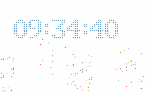

# canvas-clock
canvas数字时钟效果

## 插件化

_使用说明_
```html
<!--构建插件-->
<div id="clock" style="height:200px;width: 300px;;">
    <canvas id="canvas" style="height:100%;width:100%">
        当前浏览器暂不支持canvas，请更换浏览器之后再试一试
    </canvas>
</div>
```
定义外围div的id为**clock**即可

_效果图_
<br>


